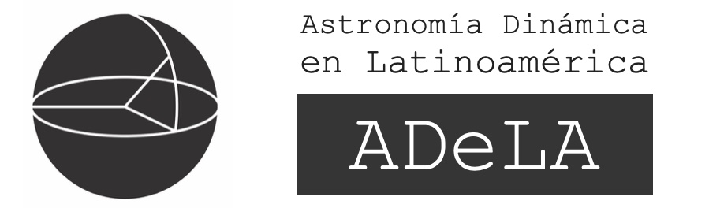

ADeLA reunirá a investigadores de todos los países latinoamericanos, y más allá, para compartir sus recientes investigaciones y descubrimientos, así como evaluar el estado del arte en Astrometría y Astronomía Dinámica. Además, es una gran oportunidad para establecer nuevas colaboraciones y buscar posibles financiamientos en áreas como técnicas astrométricas terrestres y espaciales (paralajes trigonométricas, movimientos propios, sistemas de referencia, catálogos, mantenimiento del tiempo, etc.), técnicas de interferometría radio y óptica, seguimiento astrométrico de satélites y escombros espaciales, estructura galáctica, estudios del Sistema Solar incluyendo redes de detectiones de bólidos, entre otros. 

Del 7 al 9 de abril al mediodía se realizará la reunión principal y del 9 en la tarde al 11 se llevará a cabo el Taller Avanzado  "Astrofísica con Gaia y Aprendizaje Automático", dirigido a estudiantes graduados de Astronomía y Ciencias Planetarias. Este taller se centrará en el procesamiento adecuado y el uso óptimo de los datos y recursos del catálogo Gaia para diversos temas astrofísicos, incluyendo la aplicación de herramientas de aprendizaje automático (machine learning).